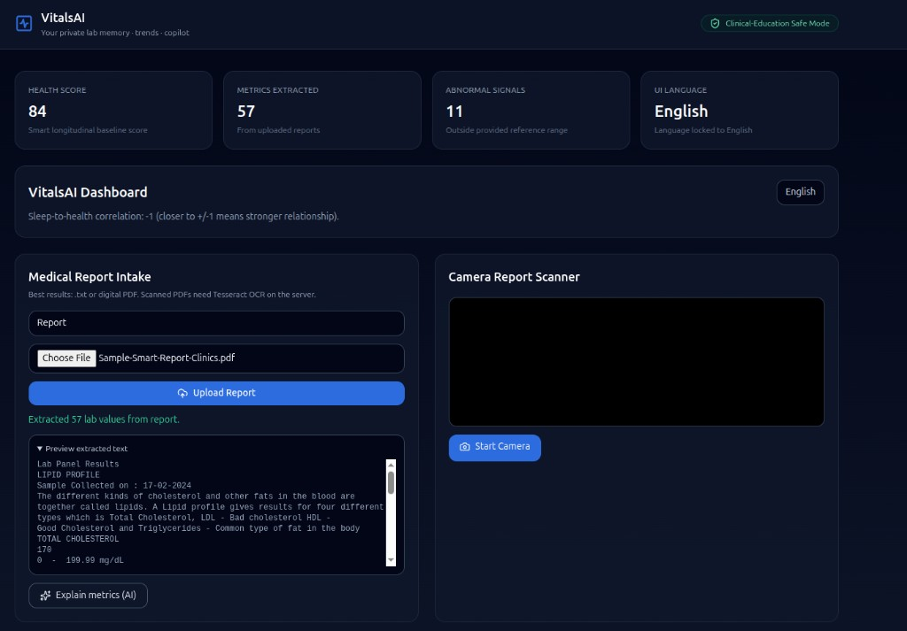
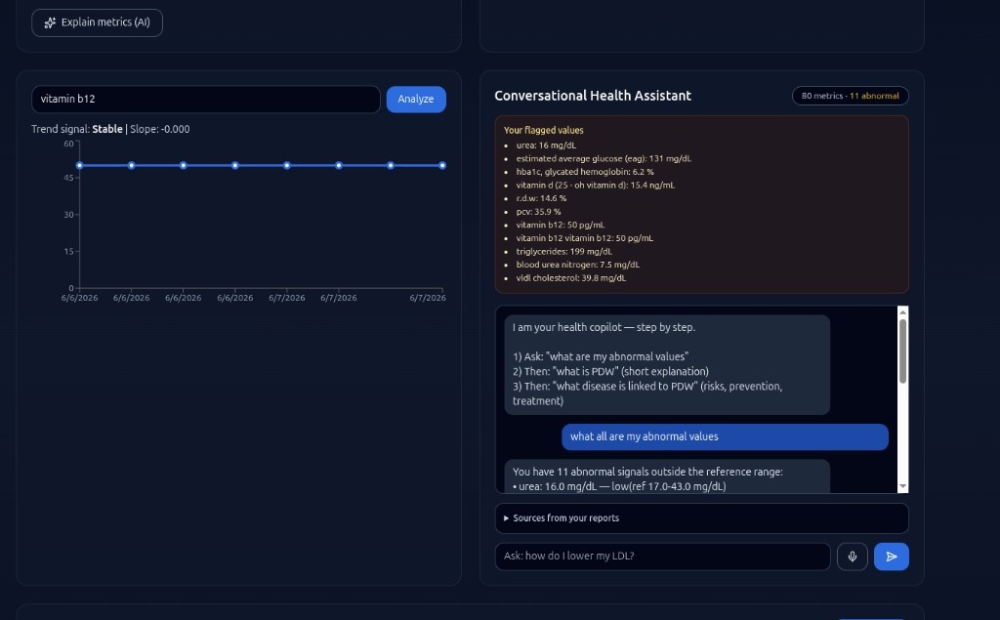
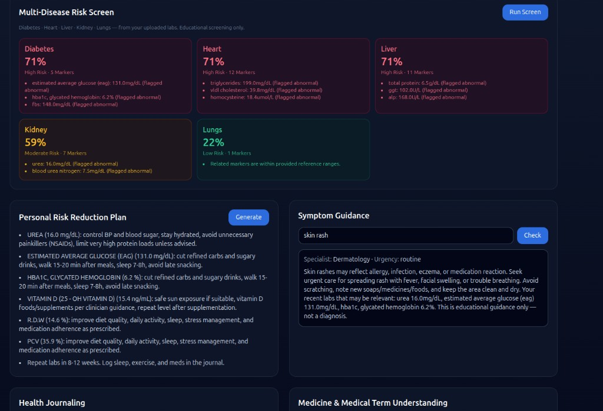
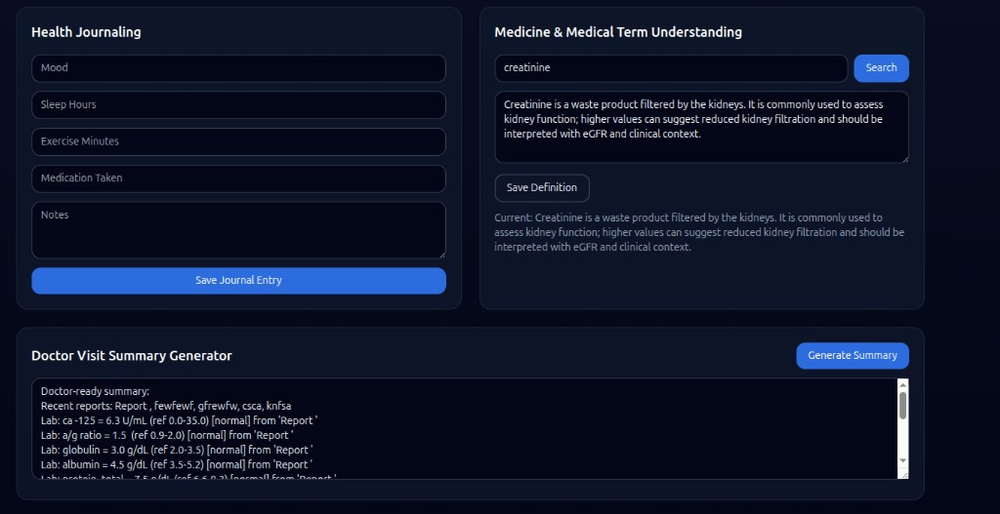
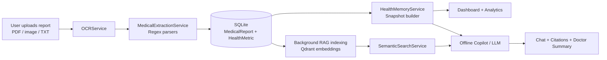
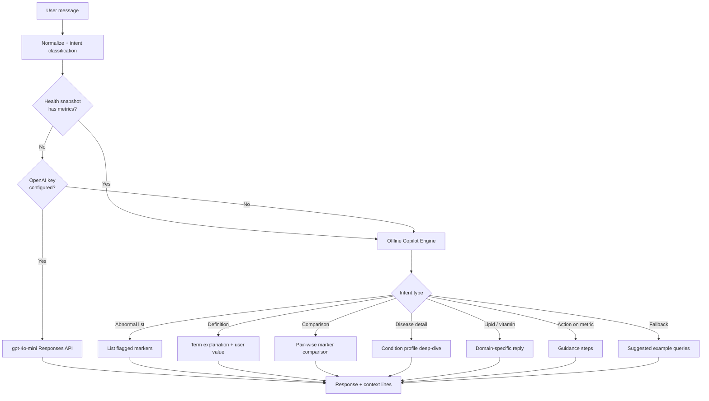
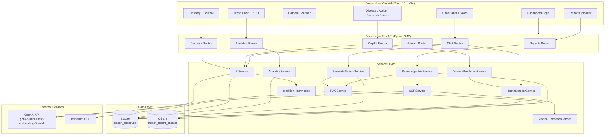

<div align="center">

# VitalsAI — Personal Health Copilot

**A production-grade, full-stack AI health intelligence platform that transforms unstructured medical reports into structured lab memory, semantic retrieval, and conversational clinical education.**

[](https://streamlit.io/)
[](https://python.org/)
[](https://platform.openai.com/)
[](https://streamlit.io/cloud)
[](#-license)

[Executive Summary](#-executive-summary) · [Screenshots](#-screenshots) · [Architecture](#-system-architecture) · [Installation](#-installation) · [API Reference](#-api-reference) · [Contributing](#-contributing)

</div>

---

## 🚀 Executive Summary

Patients receive medical reports as PDFs, images, and dense lab printouts — but most people cannot interpret reference ranges, trend markers, or clinical abbreviations without repeated clinician visits. Generic AI chatbots amplify this problem: they hallucinate values, ignore the patient's actual labs, and provide no traceability back to source documents.

**VitalsAI** (branded in the frontend; backend service name: *Personal Health Copilot API*) solves this by building an end-to-end pipeline from **document ingestion → OCR → structured metric extraction → persistent health memory → hybrid semantic retrieval → AI-assisted explanation**. Users upload reports once; the system extracts structured lab values, flags abnormalities, indexes report text for retrieval-augmented generation (RAG), and exposes a unified dashboard for trends, risk screening, symptom guidance, journaling, and conversational Q&A grounded in the user's own data.

The architecture deliberately separates **deterministic clinical parsing** (regex-based lab extraction, rule-based offline copilot) from **probabilistic AI** (OpenAI `gpt-4o-mini` via the Responses API, `text-embedding-3-small` embeddings). When lab data exists, chat routes through a large offline intent engine backed by 10 curated condition profiles and 30+ glossary terms — ensuring reliable, reproducible answers without API dependency. LLM inference augments metric explanations, symptom guidance, doctor summaries, and glossary lookups when an API key is configured.

This is an **educational health copilot**, not a diagnostic system. Every AI surface includes non-diagnostic disclaimers and clinician follow-up guidance.

---

## 📸 Screenshots

### Dashboard & Report Intake

Upload PDF, image, or text reports — the pipeline extracts structured lab values, updates KPIs (health score, metrics count, abnormal signals), and previews raw OCR text. Camera scanner supports live capture for manual upload.



### Trend Analysis & Conversational Copilot

Chart any extracted metric over time (slope + signal detection). The health copilot answers natural-language questions grounded in your actual labs, with flagged values and report citations visible in the UI. Voice input supported.



### Multi-Disease Risk Screen, Action Plan & Symptom Guidance

Run a cross-system risk screen (diabetes, heart, liver, kidney, lungs) from uploaded labs. Generate a personal risk-reduction plan from abnormal markers. Symptom guidance routes to the right specialist and urgency level, with relevant lab context.



### Health Journal, Glossary & Doctor Summary

Log daily wellness data (mood, sleep, exercise, medication). Search and save medical term definitions. Generate a doctor-ready visit summary from your full lab history and recent reports.



---

## 🎯 Problem Statement

Healthcare AI systems face well-documented engineering and safety challenges that this project directly addresses:

| Challenge | Industry Impact | VitalsAI Response |
|-----------|----------------|-------------------|
| **Unstructured medical documents** | Lab PDFs, scans, and hospital printouts resist programmatic parsing | Multi-stage OCR pipeline (PyMuPDF → pypdf → Tesseract) with regex metric extraction |
| **Hallucinated lab values** | Generic LLMs invent numbers not present in patient records | Health memory layer builds snapshots from extracted `HealthMetric` rows; chat UI surfaces actual values |
| **Knowledge retrieval gaps** | Single-document QA fails across report history | Hybrid retrieval: lexical cosine similarity over stored reports + Qdrant vector search fallback |
| **Multi-document reasoning** | Patients accumulate reports over months/years | Deduplicated metric snapshots (latest value per marker), trend analytics, correlation with journal data |
| **Clinical information bottlenecks** | Patients wait for appointments to understand flagged results | Offline copilot with condition deep-dives (meaning, risks, prevention, treatment) + glossary module |
| **Unsafe diagnostic overreach** | Medical chatbots overstate certainty | Rule-based urgency routing for symptoms; explicit educational disclaimers throughout |

---

## 💡 Solution Overview

### End-to-End Workflow



### User Journey

1. **Ingest** — Upload a report (`.txt`, `.pdf`, `.png`, `.jpg`, `.jpeg`, `.webp`) or capture via camera, then submit through Medical Report Intake.
2. **Extract** — Backend OCR reads the document; regex parsers extract named metrics with reference ranges and abnormality flags.
3. **Persist & Index** — Structured metrics and raw text are stored in SQLite; report text is chunked and embedded into Qdrant (`health_report_chunks` collection).
4. **Explore** — Dashboard KPIs update (health score, abnormal signal count). User can chart trends, run multi-disease risk screen, generate action plans, and query the copilot.
5. **Converse** — Chat queries trigger health snapshot assembly, semantic citation retrieval (top-4), and offline/LLM response generation with source excerpts displayed in the UI.
6. **Track** — Journal entries (mood, sleep, exercise, medication) feed correlation analytics against lab trends.

### Decision-Making Flow (Chat)



> **Engineering note:** When uploaded lab metrics exist, `AIService.health_chat()` routes exclusively to the offline copilot engine. The LLM path activates only when the health snapshot contains zero metrics. Citations are still retrieved and returned to the frontend regardless of routing path.

---

## ✨ Key Highlights

| Feature | What It Does | Why It Matters | Implementation |
|---------|--------------|----------------|----------------|
| **Medical Report Intake** | Accepts text, PDF, and image reports with title metadata | Eliminates manual data entry for lab tracking | `POST /reports/upload` → `ReportIngestionService` → `OCRService` + `MedicalExtractionService` |
| **Multi-Stage OCR** | Extracts text from digital PDFs and scanned documents | Handles real-world report formats (digital + scanned) | PyMuPDF text layer → pypdf fallback → Tesseract OCR (max 10 OCR pages, 25 PDF pages, 80K char cap) |
| **Regex Lab Extraction** | Parses colon-separated, inline, stacked, and vital-sign formats | Deterministic, auditable metric parsing without LLM cost | 6 regex patterns in `extraction_service.py`; computes `is_abnormal` from reference ranges |
| **Health Memory Snapshots** | Deduplicated latest metrics across up to 5 recent reports | Single source of truth for copilot and analytics | `HealthMemoryService.build_health_snapshot()` — 80-metric cap, abnormal-priority from latest report |
| **Hybrid Semantic Search** | Retrieves relevant report excerpts for chat context | Grounds answers in uploaded documents | Lexical cosine similarity first; Qdrant embedding search fallback (`SemanticSearchService`) |
| **RAG Pipeline** | Indexes report chunks with OpenAI embeddings | Enables semantic retrieval across report history | 600-char chunks, 80-char overlap, max 20 chunks/report, cosine distance in Qdrant |
| **Offline Copilot Engine** | Rule-based Q&A for lab terms, comparisons, and condition deep-dives | Reliable responses without API dependency; reproducible for demos | 10 condition profiles, 30+ offline glossary terms, intent classifiers in `ai_service.py` |
| **Conversational Chat** | Natural-language lab Q&A with citations and health snapshot | Patient education grounded in personal data | `POST /chat` — persists history, returns `health_snapshot` + `citations[]` |
| **Multi-Disease Risk Screen** | Screens diabetes, heart, liver, kidney, lung risk from labs | Surfaces cross-system patterns from a single upload | Keyword-matched metric groups + arithmetic scoring in `DiseasePredictionService` |
| **Trend Analytics** | Linear regression slope and signal detection per metric | Longitudinal insight from repeated uploads | NumPy `polyfit`; signals: `rising`, `falling`, `stable`, `insufficient_data` |
| **Sleep–Lab Correlations** | Pearson correlation between journal sleep and lab values | Connects lifestyle data to biomarker trends | `AnalyticsService.correlation_summary()` |
| **Symptom Guidance** | Specialist routing + urgency classification + advice | Bridges symptoms with existing lab context | Keyword-based routing in `copilot.py` + `AIService.symptom_guidance()` |
| **Action Plan Generator** | Per-abnormal-marker reduction steps | Actionable lifestyle guidance from flagged labs | `GET /copilot/action-plan` using `_reduction_steps_for_metric()` |
| **Doctor Visit Summary** | AI-generated handoff summary from patient context | Reduces information loss between visits | `GET /chat/doctor-summary` → `AIService.doctor_summary()` |
| **Medical Glossary** | Search, explain, and curate medical terms | Persistent term knowledge base | `MedicalTerm` table; auto-creates on first lookup; LLM regeneration for weak entries |
| **Health Journaling** | Log mood, sleep, exercise, medication, notes | Enables lifestyle–biomarker correlation | `HealthJournal` model; last 50 entries returned |
| **Voice Input** | Speech-to-text for chat queries | Accessibility and hands-free interaction | Web Speech API via `useVoiceAssistant` hook |
| **Camera Scanner** | Live camera capture of report pages | Mobile-friendly document intake | `getUserMedia` → canvas capture → PNG file for manual upload |

---

## 🏗 System Architecture



### Component Responsibilities

| Layer | Component | Role |
|-------|-----------|------|
| **Presentation** | React dashboard (12 components) | Single-page app with dark-theme clinical UI |
| **API Gateway** | FastAPI + CORS middleware | REST API at `/api/v1`, health check at `/health` |
| **Ingestion** | OCR + Extraction pipeline | Unstructured document → structured metrics |
| **Memory** | HealthMemoryService | Snapshot assembly, prompt line formatting, doctor context |
| **Retrieval** | SemanticSearchService + RAGService | Two-tier citation retrieval for chat grounding |
| **Intelligence** | AIService + condition_knowledge | Offline copilot, LLM augmentation, symptom guidance |
| **Analytics** | AnalyticsService | Trend slopes, sleep correlations, health score |
| **Screening** | DiseasePredictionService | Rule-based multi-disease risk estimation |
| **Persistence** | SQLModel + SQLite | Reports, metrics, chat history, journal, glossary |
| **Vector Store** | Qdrant (server or local file mode) | Embedding-indexed report chunks |

---

## ⚙ Complete Technical Workflow

Only stages **actually implemented** in the codebase are listed below.

| Step | Stage | Implementation | File(s) |
|------|-------|----------------|---------|
| 1 | **User query ingestion** | `POST /api/v1/chat` receives `{ message }`; last 12 chat turns loaded from DB | `routers/chat.py` |
| 2 | **Query preprocessing** | Lowercasing, typo correction (`cholestrol` → `cholesterol`), dotted-abbrev normalization (`r.d.w` → `rdw`) | `ai_service.py` → `_normalize_msg()` |
| 3 | **Health snapshot assembly** | Latest 5 reports; deduplicated metrics (80 cap); abnormal markers prioritized from most recent report | `memory_service.py` |
| 4 | **Context retrieval (lexical)** | Token-level cosine similarity across all `MedicalReport.raw_text`; boilerplate filtering; query-term snippet windowing | `vector_service.py` |
| 5 | **Embedding generation** | OpenAI `text-embedding-3-small` (1536 dimensions) for query and indexed chunks | `rag_service.py` → `_embed()` |
| 6 | **Vector search** | Qdrant cosine search on `health_report_chunks` collection (fallback when lexical returns nothing) | `rag_service.py` → `search()` |
| 7 | **Prompt augmentation** | Snapshot prompt lines + up to 4 citation snippets + up to 8 chat history turns | `chat.py`, `ai_service.py` |
| 8 | **Intent classification** | Offline engine: abnormal list, definition, comparison, disease detail, lipid/vitamin, action, fallback | `ai_service.py` → `_offline_copilot_reply()` |
| 9 | **LLM inference** | OpenAI Responses API with `gpt-4o-mini` — only when snapshot has **zero metrics** and API key is set | `ai_service.py` → `health_chat()` |
| 10 | **Response generation** | Structured text with condition profiles, user lab values, citations; persisted to `ChatMessage` | `chat.py`, `ai_service.py` |

**Not implemented:** Re-ranking, multi-agent orchestration, tool-calling agents, LLM-based metric extraction, or trained ML classifiers for disease prediction.

---

## 🧠 AI & Machine Learning Components

| Component | Technology | Purpose | Architecture Role |
|-----------|------------|---------|-------------------|
| **Primary LLM** | OpenAI `gpt-4o-mini` (Responses API) | Metric explanations, glossary, doctor summaries, symptom guidance, chat (no-metrics path) | Probabilistic augmentation layer with 5s timeout |
| **Embedding Model** | OpenAI `text-embedding-3-small` (1536-d) | Report chunk and query vectorization for RAG | Enables semantic retrieval in Qdrant |
| **Vector Database** | Qdrant (`health_report_chunks`) | Stores embedded report chunks with metadata payload | Server mode (`QDRANT_URL`) or local file mode (`QDRANT_LOCAL_PATH`); auto-failover |
| **Lexical Retrieval** | Custom cosine similarity (token Counter) | First-pass citation search over raw report text | Zero-dependency fallback; no embedding cost |
| **Chunking Strategy** | Sliding window: 600 chars, 80 overlap, max 20/report | Balances context granularity vs. storage cost | Applied during background indexing on upload |
| **Condition Knowledge Base** | 10 hardcoded `ConditionProfile` entries | Offline disease deep-dives (risks, prevention, treatment) | Deterministic clinical education without LLM |
| **Offline Glossary** | 30+ terms in `AIService.offline_terms` | Instant term definitions (PDW, RDW, HbA1c, TSH, etc.) | Zero-latency fallback for common lab markers |
| **Disease Screening** | Keyword-matched metric groups + arithmetic scoring | Multi-disease risk estimation (not ML) | `base 15` (no data) → `22` (all normal) → `min(92, 35 + 12×abnormal_count)` |
| **Trend Detection** | NumPy linear regression (`polyfit`) | Slope-based signal classification | Thresholds: rising (>0.2), falling (<−0.2), stable |
| **Correlation Engine** | Pearson correlation (manual implementation) | Sleep hours vs. same-day mean metric values | Links journal lifestyle data to lab trends |
| **Prompt Engineering** | Inline system prompts per feature | Medical education framing, non-diagnostic guardrails, word limits | Separate prompts for chat, metrics, terms, symptoms, doctor summary |

### Offline Copilot Intent Matrix

| Intent | Trigger Examples | Handler |
|--------|-----------------|---------|
| Abnormal list | "what are my abnormal values", "flagged signals" | `_abnormal_list_reply()` |
| Definition | "what is RDW", "what does r.d.w mean" | `_term_short_reply()` |
| Comparison | "is PDW and anemia the same?" | `_comparison_reply()` with known pairs |
| Disease detail | "what disease is linked to RDW", "how is it harmful" | `_condition_deep_reply()` |
| Lipid panel | "cholesterol", "LDL", "triglycerides" | `_cholesterol_reply()` |
| Vitamin | "vitamin d", "b12" | `_vitamin_reply()` |
| Metric action | "how to reduce LDL" | `_metric_answer()` with guidance steps |
| Symptom | "chest tightness" (via Symptom Panel) | `symptom_guidance()` — separate from chat copilot |

---

## 🔍 Advanced Features Deep Dive

### Medical Report Ingestion & OCR

**Problem:** Medical reports arrive as unstructured PDFs, phone photos, and plain text with inconsistent formatting.

**Implementation:**
- `OCRService.extract_text()` handles `.txt`, `.pdf`, and image formats
- PDF pipeline: PyMuPDF native text → pypdf fallback → Tesseract OCR on rendered pages (2× scale)
- Guardrails: max 25 PDF pages, max 10 OCR pages, 80,000 character cap, 1800px image width limit
- Returns extraction method metadata (`pdf_text`, `pdf_ocr`, `image_ocr`, `pdf_sparse`, etc.)

**Workflow:**
```
File upload → MIME detection → text extraction → raw_text stored → regex metric parsing → HealthMetric rows
                                      ↓
                              BackgroundTasks → RAGService.index_report()
```

**Benefits:** Handles both digital and scanned reports; provides parse hints when zero metrics are extracted.

---

### Regex-Based Lab Extraction

**Problem:** LLM-based extraction is non-deterministic, costly, and can hallucinate values.

**Implementation:** `MedicalExtractionService` uses 6 compiled regex patterns:
- `LINE_METRIC_PATTERN` — `Name: Value Unit (ref_min–ref_max)`
- `INLINE_METRIC_PATTERN` — inline metrics within prose
- `UPPER_ONLY_PATTERN` — `< ref_max` upper-bound-only ranges
- `LOOSE_LINE_PATTERN` — value without reference range
- `STACKED_REF_LINE` + `STACKED_VALUE_LINE` — stacked hospital lab layouts
- `VITAL_PATTERN` — Weight, Height, BMI, Pulse, SpO2, Temperature, BP

**Benefits:** Auditable, zero API cost, instant extraction; abnormality computed from parsed reference ranges.

---

### Hybrid Retrieval (Lexical + Vector)

**Problem:** Pure vector search requires embedding API calls; pure keyword search misses semantic similarity.

**Implementation:**
1. `SemanticSearchService.search_citations()` runs lexical cosine similarity over all stored report texts
2. Snippet extraction uses query-term windowing (±60 chars) with boilerplate filtering
3. If lexical returns zero results, falls back to `RAGService.search_citations()` (Qdrant + OpenAI embeddings)
4. Chat router requests `top_k=4` citations per query

**Benefits:** Zero-cost retrieval when lexical matches exist; semantic fallback for paraphrased queries.

---

### RAG Indexing Pipeline

**Problem:** Full report text exceeds LLM context windows; users need relevant excerpts, not entire documents.

**Implementation:**
- Collection: `health_report_chunks` with cosine distance, 1536-d vectors
- Chunking: 600-character sliding window, 80-character overlap, max 20 chunks per report
- Point IDs: MD5 hash of `{report_id}:{chunk_index}`
- Payload: `report_id`, `title`, `chunk_index`, `text`
- Indexing triggered via FastAPI `BackgroundTasks` on report upload
- Reindex endpoint: `POST /api/v1/reports/reindex-rag`

**Qdrant connection priority** (configurable via `QDRANT_PREFER_LOCAL`):
- Default (`true`): local file store first → server URL fallback
- Alternative: server first → local fallback

---

### Offline Copilot Engine

**Problem:** LLM responses are non-deterministic, latency-sensitive, and require API keys — unsuitable as the sole path for lab Q&A with uploaded data.

**Implementation:** When `HealthSnapshot.metrics` is non-empty, `health_chat()` routes exclusively to `_offline_copilot_reply()` — a ~900-line rule engine with:
- Intent classifiers (definition, comparison, abnormal list, disease detail, action)
- 10 condition profiles with structured sections (meaning, risks, prevention, treatment)
- Known comparison pairs (anemia/RDW, PDW/RDW, HbA1c/glucose, LDL/HDL, creatinine/urea)
- Domain handlers for lipids, vitamins, and per-metric guidance steps
- Dotted-abbreviation normalization (`r.d.w:` → `rdw`)
- Word-boundary matching to prevent false intent triggers (e.g., "list" inside "specialist")

**Benefits:** Reproducible demo behavior, sub-10ms response times, works offline, integrates user's actual lab values into every answer.

---

### Multi-Disease Risk Screen

**Problem:** Patients with multi-system lab abnormalities need a structured overview, not isolated marker explanations.

**Implementation:** `DiseasePredictionService` maps 5 disease categories to keyword-matched metric groups:

| Disease | Matched Metric Keywords |
|---------|------------------------|
| Diabetes | glucose, sugar, hba1c, fbs, ppbs, eag |
| Heart | ldl, hdl, cholesterol, triglyceride, hs-crp, homocysteine, apob, lp(a) |
| Liver | alt, ast, bilirubin, alp, ggt, albumin |
| Kidney | creatinine, egfr, urea, bun, uric, acr |
| Lungs | wbc, esr, spo2, nt-probnp, trop |

Scoring: `min(92, 35 + len(abnormal) × 12)` with risk levels at 45 (moderate) and 70 (high).

**Benefits:** Cross-system pattern surfacing from a single upload; transparent factor listing per disease.

---

### Symptom Guidance Module

**Problem:** Symptom queries routed through the lab copilot produced irrelevant abnormal-value lists.

**Implementation:** Dedicated `POST /copilot/symptoms` endpoint with:
- Keyword-based specialist and urgency routing (chest tightness → Emergency/Cardiology, urgent)
- `AIService.symptom_guidance()` — LLM when API key available, offline fallback with symptom-specific advice
- Lab context integration: surfaces relevant abnormal markers (e.g., PCV, HbA1c for chest symptoms)

---

## 📂 Repository Structure

```
MEDICAL ASSISTANT/
├── README.md                          # This file
├── start.sh                           # One-command local dev (backend + frontend)
├── stop.sh                            # Kill uvicorn + vite processes
├── docker-compose.yml                 # Qdrant + backend + frontend services
├── sample-medical-report.txt          # Synthetic multi-panel lab report for testing
├── .gitignore
│
├── backend/
│   ├── Dockerfile                     # Python 3.12-slim + Tesseract
│   ├── requirements.txt               # FastAPI, SQLModel, OpenAI, Qdrant, NumPy, OCR deps
│   ├── .env.example                   # All backend environment variables
│   └── app/
│       ├── main.py                    # FastAPI app, CORS, startup (init_db + RAG collection)
│       ├── core/
│       │   ├── config.py                # Pydantic settings (all env vars)
│       │   └── db.py                    # SQLite engine, session factory
│       ├── models/
│       │   └── entities.py            # MedicalReport, HealthMetric, ChatMessage, HealthJournal, MedicalTerm
│       ├── schemas/
│       │   └── health.py              # Pydantic request/response models
│       ├── routers/
│       │   ├── reports.py             # Upload, reindex-rag, metric explanations
│       │   ├── chat.py                # Chat + doctor summary
│       │   ├── analytics.py           # Trends, correlations, health score
│       │   ├── journal.py             # Health journal CRUD
│       │   ├── glossary.py            # Term lookup and curation
│       │   └── copilot.py             # Disease predictions, action plan, symptoms
│       └── services/
│           ├── ai_service.py          # LLM + offline copilot engine (~900 lines)
│           ├── condition_knowledge.py # 10 curated condition profiles
│           ├── rag_service.py         # Qdrant indexing + embedding search
│           ├── vector_service.py      # Lexical cosine retrieval
│           ├── extraction_service.py  # Regex lab metric parsers
│           ├── ocr_service.py         # PDF/image text extraction
│           ├── ingestion_service.py   # Upload orchestration pipeline
│           ├── memory_service.py      # Health snapshot builder
│           ├── prediction_service.py  # Multi-disease risk screening
│           └── analytics_service.py   # Trend + correlation analytics
│
└── frontend/
    ├── Dockerfile                     # Node 20 Alpine, dev server
    ├── package.json                   # React 18, Vite, Tailwind, Recharts, Axios
    ├── .env.example                   # VITE_API_BASE_URL
    └── src/
        ├── App.tsx                    # Single route → DashboardPage
        ├── pages/DashboardPage.tsx    # Main dashboard orchestrator
        ├── services/api.ts            # Axios client (14 API functions)
        ├── types/index.ts             # Shared TypeScript interfaces
        ├── hooks/useVoiceAssistant.ts # Web Speech API integration
        ├── styles/index.css           # Tailwind + dark theme base
        └── components/
            ├── Layout.tsx             # App shell + safety badge
            ├── ReportUploader.tsx     # File upload + AI explanations
            ├── CameraScanner.tsx      # Live camera capture
            ├── ChatPanel.tsx          # Copilot chat + voice + citations
            ├── TrendChart.tsx         # Recharts line chart
            ├── DiseasePredictionPanel.tsx
            ├── ActionPlanPanel.tsx
            ├── SymptomPanel.tsx
            ├── JournalPanel.tsx
            ├── GlossaryPanel.tsx
            └── KpiCard.tsx
```

---

## 🛠 Technology Stack

| Layer | Technology | Version / Config | Purpose |
|-------|------------|------------------|---------|
| **Frontend Framework** | React | 18.3 | Component-based SPA |
| **Frontend Build** | Vite | 6.x | Dev server + production bundler |
| **Frontend Language** | TypeScript | 5.x | Type-safe UI development |
| **UI Styling** | Tailwind CSS | 3.x | Dark-theme clinical dashboard |
| **Charts** | Recharts | 2.15 | Metric trend visualization |
| **HTTP Client** | Axios | 1.11 | API communication (120s timeout) |
| **Icons** | Lucide React | 0.542 | UI iconography |
| **Notifications** | react-hot-toast | 2.6 | Toast feedback across panels |
| **Routing** | React Router DOM | 6.30 | Client-side routing (single page) |
| **Backend Framework** | FastAPI | latest | Async REST API with OpenAPI docs |
| **ASGI Server** | Uvicorn | standard | Production-ready HTTP server |
| **ORM** | SQLModel | latest | SQLAlchemy + Pydantic model layer |
| **Database** | SQLite | default | Local persistent storage (`health_copilot.db`) |
| **Primary LLM** | OpenAI gpt-4o-mini | configurable | Medical explanations, summaries, symptom guidance |
| **Embedding Model** | text-embedding-3-small | 1536 dimensions | RAG chunk vectorization |
| **Vector Database** | Qdrant | server or local file | Semantic report chunk storage |
| **OCR Engine** | Tesseract | eng | Scanned PDF/image text extraction |
| **PDF Parsing** | PyMuPDF + pypdf | latest | Native PDF text layer extraction |
| **Image Processing** | Pillow | latest | Image preprocessing for OCR |
| **Analytics** | NumPy | latest | Trend slopes, correlation computation |
| **AI SDK** | OpenAI Python SDK | latest | Responses API + embeddings |
| **Vector Client** | qdrant-client | latest | Qdrant collection management + search |
| **Config Management** | pydantic-settings | latest | Environment variable loading |
| **Containerization** | Docker Compose | 3 services | Qdrant + backend + frontend orchestration |
| **System Dependency** | Tesseract OCR | apt/brew | Required for scanned document processing |

---

## 📊 Performance Considerations

| Aspect | Current Implementation | Notes |
|--------|----------------------|-------|
| **Chat latency (with labs)** | Sub-10ms (offline copilot) | No API call when metrics exist; deterministic rule engine |
| **Chat latency (no labs + LLM)** | ~1–5s | OpenAI Responses API with 5s timeout; exception → offline fallback |
| **Report upload** | Background RAG indexing | Upload returns immediately; Qdrant indexing runs via `BackgroundTasks` |
| **OCR throughput** | Max 10 OCR pages, 25 PDF pages | Prevents runaway processing on large documents |
| **Text size cap** | 80,000 characters | Limits memory footprint per report |
| **Metric snapshot cap** | 80 deduplicated metrics | Bounds copilot context size |
| **Chat history window** | Last 8 turns to LLM; last 12 stored | Balances context vs. token cost |
| **Citation retrieval** | Top-4 excerpts | Limits prompt augmentation size |
| **RAG chunk budget** | Max 20 chunks × 600 chars per report | ~12K chars max indexed per report |
| **Embedding timeout** | 15s (RAGService) vs 5s (AIService) | Separate timeouts for indexing vs. inference |
| **Database** | SQLite (single-file) | Suitable for local/demo; production would benefit from PostgreSQL |
| **Frontend API timeout** | 120 seconds | Accommodates slow OCR on large scanned PDFs |

---

## 🔐 Security & Reliability

| Measure | Implementation |
|---------|----------------|
| **Input validation** | Pydantic `Field(min_length=3)` on symptom requests; file type detection in OCR service |
| **Environment isolation** | `.env` files gitignored; `.env.example` templates provided |
| **CORS configuration** | Configurable origins via `CORS_ORIGINS` (default: localhost:5173/5174) |
| **Error handling** | Try/except on all OpenAI calls with offline fallback; OCR method metadata for debugging |
| **Boilerplate filtering** | Regex exclusion of hospital headers, disclaimers, phone numbers from citations |
| **Non-diagnostic guardrails** | Educational disclaimers on all AI outputs; disease screen labeled "screening estimate only" |
| **Abnormality computation** | Server-side from parsed reference ranges — not LLM-inferred |
| **Health check endpoint** | `GET /health` reports RAG readiness, mode, and AI configuration status |
| **Graceful degradation** | Offline copilot, lexical search, and local Qdrant mode all function without OpenAI API key |
| **Port conflict resolution** | `start.sh` frees ports 8000/5173 before launching |

**Not implemented:** Authentication, authorization, rate limiting, encryption at rest, HIPAA compliance tooling, or audit logging. This is a local-first educational scaffold.

---

## 🎓 Research & Engineering Contributions

### Design Decisions

1. **Deterministic-first architecture.** Lab extraction and primary chat routing use regex and rule engines rather than LLM parsing. This eliminates hallucinated lab values — a documented failure mode in healthcare AI — and enables reproducible demos without API costs.

2. **Hybrid retrieval over pure RAG.** Lexical cosine similarity runs before embedding-based search, reducing API calls for keyword-aligned queries while preserving semantic fallback for paraphrased questions.

3. **Dual-mode Qdrant deployment.** Local file mode (`QDRANT_LOCAL_PATH`) eliminates infrastructure dependency for development; server mode (`QDRANT_URL`) supports Docker Compose production layouts. Connection priority is configurable.

4. **Offline copilot as primary chat path.** When lab data exists, the system prioritizes a curated knowledge base (10 condition profiles, 30+ glossary terms, known comparison pairs) over LLM generation. This is an intentional tradeoff: **reliability and traceability over generative fluency**.

5. **Separation of symptom and lab copilot paths.** Symptom guidance uses a dedicated endpoint and response generator, preventing lab-intent classifiers from misrouting clinical symptom queries.

### Engineering Tradeoffs

| Decision | Benefit | Cost |
|----------|---------|------|
| Offline copilot for chat (when labs exist) | Zero latency, no API cost, reproducible | Less fluent than full LLM chat |
| Regex extraction vs. LLM parsing | Deterministic, auditable, instant | Misses non-standard report formats |
| SQLite vs. PostgreSQL | Zero-config local development | Limited concurrent write scalability |
| Rule-based disease screening vs. ML models | Transparent scoring, no training data needed | Not clinically validated |
| Single-page dashboard vs. multi-page app | Simpler state management | All features on one screen |

---

## 🌍 Real-World Applications

| Application | Supported By |
|-------------|-------------|
| **Patient lab report comprehension** | Metric extraction, abnormality flags, glossary, offline copilot definitions |
| **Longitudinal health tracking** | Trend analytics, deduplicated metric snapshots across uploads |
| **Pre-visit preparation** | Doctor visit summary generator, action plan from abnormal markers |
| **Lifestyle–biomarker correlation** | Health journaling with sleep-to-lab Pearson correlation |
| **Multi-system risk awareness** | Disease prediction screen across 5 organ systems |
| **Symptom triage education** | Specialist routing with urgency classification |
| **Medical term self-education** | Searchable glossary with user-curated definitions |
| **Clinical research prototyping** | Modular service architecture for swapping extraction models, vector DBs, or LLMs |

---

## 🚀 Installation

### Deploy on Streamlit Cloud (free)

1. Go to **[share.streamlit.io](https://share.streamlit.io)** → sign in with GitHub
2. **New app** → Repository: `abhijaymishra07/VitalsAI`, Branch: `main`
3. **Main file path:** `streamlit_app.py`
4. **Advanced settings → Secrets** — paste from [`.streamlit/secrets.toml.example`](.streamlit/secrets.toml.example):
   ```toml
   OPENAI_API_KEY = "sk-your-key-here"
   ```
5. Click **Deploy**

Your app will be live at `https://YOUR-APP.streamlit.app` in ~2–3 minutes.

### Run locally

**Prerequisites:** Python 3.12+, Tesseract (optional, for scanned PDFs)

```bash
./start.sh
```

Opens at **http://localhost:8501**

Or manually:

```bash
python3 -m venv backend/.venv
source backend/.venv/bin/activate
pip install -r requirements.txt
cp backend/.env.example backend/.env   # add OPENAI_API_KEY
streamlit run streamlit_app.py
```

### Optional — FastAPI backend (dev/API only)

The Streamlit app uses the Python services directly. To run the REST API separately:

```bash
cd backend && source .venv/bin/activate
pip install -r requirements.txt uvicorn
uvicorn app.main:app --reload
```

API docs: http://127.0.0.1:8000/docs

### Verify

Upload `sample-medical-report.txt` in the **Upload & Labs** tab and confirm metrics appear.

---

## 🔧 Configuration

### Streamlit Cloud Secrets

In Streamlit Cloud → **Settings → Secrets**, or locally copy `.streamlit/secrets.toml.example` → `.streamlit/secrets.toml`:

| Variable | Required | Description |
|----------|----------|-------------|
| `OPENAI_API_KEY` | Recommended | LLM + embeddings; offline copilot works without it |
| `LLM_MODEL` | No | Default `gpt-4o-mini` |
| `EMBEDDING_MODEL` | No | Default `text-embedding-3-small` |
| `RAG_ENABLED` | No | Default `true` |

### Local `.env` (optional)

File: `backend/.env` (copy from `backend/.env.example`) — used when running locally outside Streamlit secrets.

| Variable | Default | Description |
|----------|---------|-------------|
| `OPENAI_API_KEY` | *(empty)* | OpenAI API key |
| `DATABASE_URL` | `sqlite:///./health_copilot.db` | SQLite database path |
| `LLM_MODEL` | `gpt-4o-mini` | LLM model |
| `EMBEDDING_MODEL` | `text-embedding-3-small` | Embedding model |
| `RAG_ENABLED` | `true` | Enable RAG indexing |

<!-- removed legacy frontend env table -->

---

## ▶ Usage Examples

### Upload a Report and View Extracted Metrics

**Input:** Upload `sample-medical-report.txt` with title "Annual Checkup"

**Output:**
- Dashboard KPIs update: metrics extracted count, abnormal signal count
- Parse hint displayed if extraction issues detected
- Optional: "Explain metrics (AI)" button returns per-metric explanations

### Ask the Copilot About a Lab Marker

**Input:**
```
what does r.d.w: mean and how is it harmful
```

**Output:**
```
Elevated RDW (Red Cell Distribution Width)

What it means:
• RDW measures how much your red blood cells vary in size...

Potential risks / threats:
• Often a sign of iron, B12, or folate deficiency...

Your latest lab value:
• RDW-CV: 14.6 % — above reference (reference 11.6-14.0 %)

This is educational guidance, not a diagnosis. Please confirm with your doctor.
```

### Compare Two Lab Markers

**Input:**
```
is PDW and anemia the same?
```

**Output:** Structured comparison explaining PDW (platelet marker) vs. anemia (clinical condition), with note that RDW is more relevant for anemia investigation.

### Symptom Guidance

**Input:** `chest tightness` in Symptom Guidance panel

**Output:**
- Specialist: Emergency / Cardiology
- Urgency: urgent
- Advice: Chest tightness causes, emergency warning signs, relevant lab context

### Multi-Disease Risk Screen

**Input:** Click "Run Screen" after uploading labs

**Output:** 5 disease cards (diabetes, heart, liver, kidney, lungs) each with risk score (0–92), risk level (low/moderate/high), contributing factors, and metrics used count.

### Trend Analysis

**Input:** Enter metric name `glucose` → Analyze

**Output:** Recharts line chart with slope value and signal (`rising`, `falling`, `stable`, or `insufficient_data`).

### Doctor Visit Summary

**Input:** Click "Generate" in Doctor Visit Summary section

**Output:** AI-generated (or raw context) handoff summary including abnormal values, trend concerns, and suggested questions for the clinician.

---

## 📡 API Reference

| Method | Endpoint | Description |
|--------|----------|-------------|
| `GET` | `/health` | Service health, RAG status, AI configuration |
| `POST` | `/api/v1/reports/upload` | Upload report file (multipart: `title`, `file`) |
| `GET` | `/api/v1/reports/{id}/explanations` | AI metric explanations (abnormal first, max 5) |
| `POST` | `/api/v1/reports/reindex-rag` | Re-index all reports into Qdrant |
| `POST` | `/api/v1/chat` | Conversational health copilot |
| `GET` | `/api/v1/chat/doctor-summary` | Doctor visit handoff summary |
| `POST` | `/api/v1/journal` | Create health journal entry |
| `GET` | `/api/v1/journal` | List last 50 journal entries |
| `GET` | `/api/v1/analytics/trends/{metric_name}` | Metric trend with slope and signal |
| `GET` | `/api/v1/analytics/correlations` | Sleep-to-lab correlation summary |
| `GET` | `/api/v1/analytics/health-score` | Composite health score |
| `GET` | `/api/v1/glossary/{term}` | Look up or auto-create medical term |
| `POST` | `/api/v1/glossary/{term}?explanation=...` | Upsert glossary definition |
| `GET` | `/api/v1/copilot/disease-predictions` | Multi-disease risk screen |
| `GET` | `/api/v1/copilot/action-plan` | Personal risk reduction plan |
| `POST` | `/api/v1/copilot/symptoms` | Symptom guidance with specialist routing |

Full interactive documentation: http://localhost:8000/docs

---

## 📈 Future Improvements

Based on the current architecture, realistic next steps include:

| Area | Proposed Enhancement | Rationale |
|------|---------------------|-----------|
| **Chat routing** | LLM-augmented responses even when lab data exists (hybrid: offline intent + LLM phrasing) | Current offline-only path limits conversational fluency |
| **Extraction** | Clinical NLP model (e.g., MedSpaCy, layout-aware parsers) alongside regex | Handle non-standard hospital report formats |
| **Database** | PostgreSQL with Alembic migrations | Production concurrency and schema versioning (Alembic listed in requirements but unused) |
| **Authentication** | User accounts and report isolation | Multi-user deployment requirement |
| **Re-ranking** | Cross-encoder re-ranking after vector retrieval | Improve citation relevance quality |
| **Camera integration** | Auto-upload captured images to report intake | Currently requires manual second-step upload |
| **Disease screening** | Validated ML models with calibrated probabilities | Replace keyword-based scoring with trained classifiers |
| **Wearable integration** | Import sleep/activity from Apple Health / Google Fit | Enrich journal data automatically |
| **i18n** | Multi-language OCR and copilot responses | Currently hardcoded to English |
| **Testing** | Unit and integration test suites | No test files exist in application source |
| **Production frontend** | Multi-stage Docker build with static nginx serving | Current Dockerfile runs Vite dev server |
| **License** | Add explicit open-source license file | No LICENSE currently in repository |

---

## 🤝 Contributing

Contributions are welcome. Recommended workflow:

1. **Fork** the repository and create a feature branch from `main`.
2. **Set up** the local development environment (see [Installation](#-installation)).
3. **Follow existing conventions:**
   - Backend: service-layer architecture, type hints, Pydantic schemas
   - Frontend: TypeScript strict mode, Tailwind utility classes, component-level state
   - Keep offline copilot responses educational and non-diagnostic
4. **Test manually** with `sample-medical-report.txt` and the dashboard copilot chat.
5. **Submit a pull request** with a clear description of the change and testing performed.

**Priority contribution areas:** clinical NLP extraction improvements, test coverage, authentication layer, LLM-hybrid chat routing, and production Docker builds.

---

## 📜 License

No license file is present in this repository. All rights reserved by the project author unless a license is added. Contributors should confirm licensing terms before submitting pull requests.

---

## 🏆 Why This Project Stands Out

**For recruiters and hiring managers**, this project demonstrates:

- **Full-stack ownership** — React dashboard, FastAPI backend, Docker Compose, and system-level OCR dependencies, end to end
- **AI engineering depth** — Not a thin ChatGPT wrapper: hybrid retrieval (lexical + vector), RAG indexing pipeline, offline/LLM dual routing, curated condition knowledge base, and prompt engineering across 5 distinct AI features
- **Production-aware architecture** — Graceful degradation (offline copilot, lexical fallback, local Qdrant mode), background task indexing, health check endpoint, configurable environment, and CORS management
- **Healthcare domain modeling** — Regex lab extraction with 6 format patterns, abnormality computation, multi-disease screening, symptom urgency routing, and explicit non-diagnostic safety framing
- **System design quality** — Clean service-layer separation (12 services, 6 routers, 5 SQLModel entities), typed schemas, and modular frontend components
- **Research orientation** — Documented engineering tradeoffs (deterministic vs. generative, hybrid retrieval vs. pure RAG), transparent about what is and is not ML-based

**For AI researchers**, the offline copilot + RAG hybrid represents a pragmatic approach to reducing hallucination in domain-specific QA — a known challenge in medical AI systems.

**For startup founders**, the architecture is designed for incremental scaling: swap SQLite for PostgreSQL, add auth, plug in clinical NLP models, and deploy to cloud — without restructuring the service layer.


## Author

### Abhijay Mishra

AI/ML enthusiast · Full-stack developer · Document intelligence systems

[](https://github.com/abhijaymishra07)
[](https://www.linkedin.com/in/abhijay-mishra-95289b202/)

---

<div align="center">

**Built with precision for patients who deserve to understand their own health data.**

*VitalsAI — Your private lab memory · trends · copilot*

</div>

---

<!-- repo-metadata: clean-contributor-history -->
